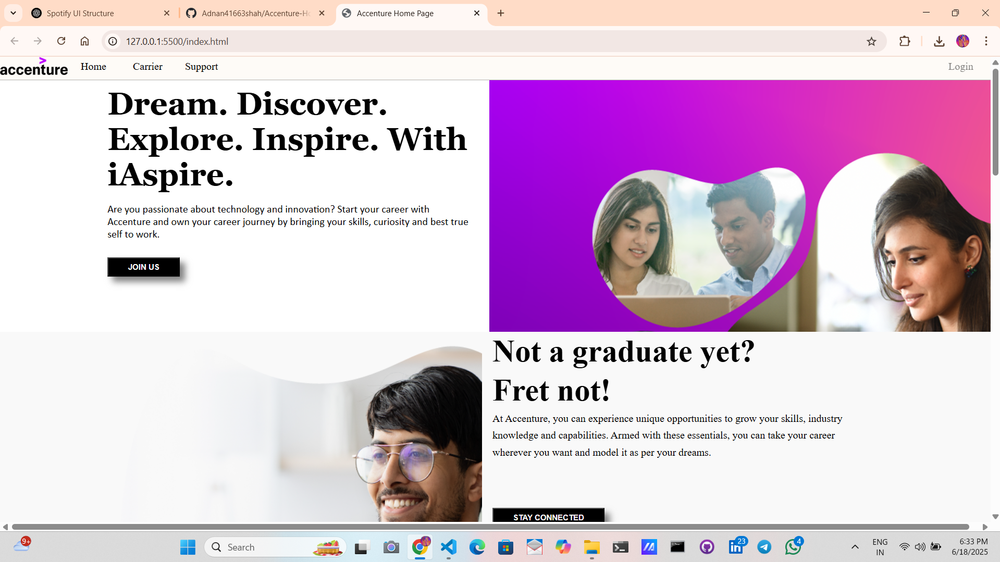
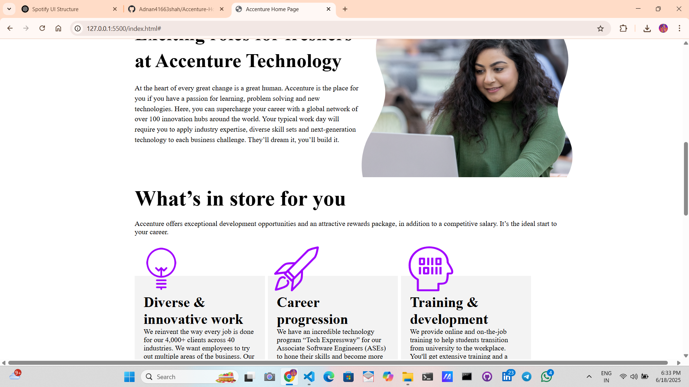
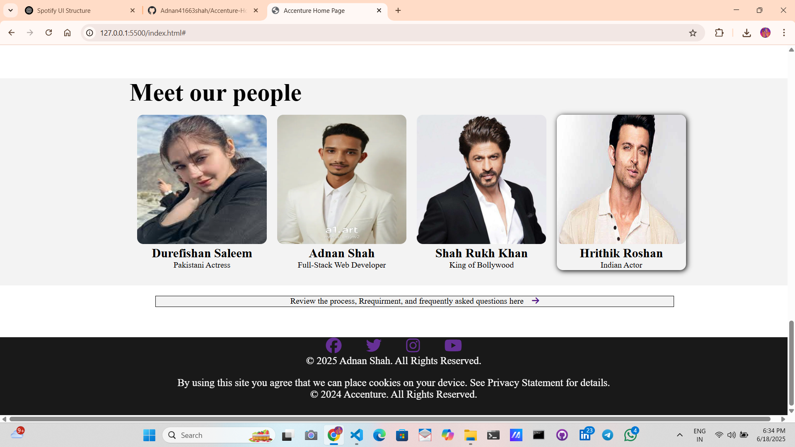

# Accenture-Inspired Landing Page 🌐

This project is a **fully responsive landing page** inspired by Accenture's modern and professional web design. Built using **pure HTML and CSS**, it showcases an interactive, clean, and elegant UI layout that reflects corporate professionalism, innovation, and user-focused design.

## 💡 Project Highlights

- ✅ Pixel-perfect design using only **HTML5 & CSS3**
- ✅ Modern layout with **sections for careers, culture, benefits, and more**
- ✅ **Sticky navbar** with intuitive navigation
- ✅ Engaging call-to-action sections with buttons
- ✅ **Image grids**, flexible content boxes, and **responsive positioning**
- ✅ Interactive **hover effects** for links, cards, and social icons
- ✅ Profiles section featuring team members and personalities
- ✅ Custom footer with social media links and privacy notice

## 📸 Preview

## 🛠️ Tech Stack

- **HTML5** – Semantic and structured content
- **CSS3** – Flexbox, Grid, Responsive Design
- **Font Awesome** – Icons for social and action elements
- **Google Fonts / Material Symbols** – Font customization

## 🧑‍💻 Author

**Adnan Shah**  
🎓 4th-Year CSE Student | 💡 Full-stack Developer  
📍 GH Raisoni University, Amravati  
📫 [Connect on LinkedIn](www.linkedin.com/in/adnan41663) 

## 🚀 How to Use

1. Clone the repository:
  https://github.com/Adnan41663shah/Accenture-Home-Page.git
Open index.html in your browser.

Explore and modify the code as per your ideas!

📌 Note
This project is for educational and personal portfolio purposes only.

All brand assets belong to Accenture, used here for inspiration and non-commercial display.

📢 Feedback
Have suggestions or want to collaborate? Feel free to open an issue or pull request!

